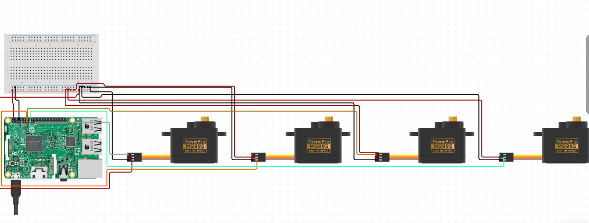

# Material Sorting Robot
This project is a robotic arm that uses object detection to distinguish between and sort items of different materials. The arm uses Google's Coral Edge TPU to do this. 

| **Engineer** | **School** | **Area of Interest** | **Grade** |
|:--:|:--:|:--:|:--:|
| Nandini R. | Lynbrook High School | Computer Engineering | Incoming Junior

headstone image goes here
  
# First Milestone
<p>My first milestone was setting up my Raspberry Pi and building and controlling my robotic arm. The parts for the robotic arm came in a kit. To build it, I just assembled the provided parts. The grabbing attachment could be attached horizontally or vertically on the arm, so I decided to keep it vertical so that it would be easier to grab items on the ground. The  arm uses 4 servo motors - 1 to control the base, 2 to control the arm, and 1 to control the grabbing attachment.</p> <p>After assembling the arm, I wired the servo motors. Each servo motor is connected to 0V, 5V, and a GPIO pin. A diagram of the wiring can be found below. When I finished wiring, my next step was to program the arm to pick an object up, move, and drop it somewhere else. You can find the code I used to program the arm to do this below. My next step will be to train a machine learning model so that eventually, the robot's movements will depend on what material it recognizes in front of it, in contrast to the current hard coded software.</p> 


**Code to control the robotic arm:** 
```python
from gpiozero import Servo
from time import sleep
base = Servo(4) #servo controlling the base
horizontal = Servo(17) #servo on the arm controlling horizontal movement
vertical = Servo(18) #servo on the arm controlling vertical movement
gripper = Servo(27) #servo controlling the gripping attachment 
try:
    while True:
        base.mid() #moves arm to the front
        sleep(0.5)
        horizontal.mid() #extends arm 
        sleep(0.5)
        vertical.min() #lowers arm
        sleep(0.5)
        gripper.min() #picks up object
        sleep(0.5)
        vertical.max() #lifts arm
        sleep(0.5)
        base.max() #moves robot around its base to a different position
        sleep(0.5)
        vertical.min() #lowers arm
        sleep(0.5)
        gripper.max() #releases object 
        sleep(0.5)
        
except KeyboardInterrupt:
    print("Program stopped")
```

**Circuit Diagram:**




<!-- milestone video here-->
milestone video coming soon 


# Second Milestone
<p>My second milestone was training my object detection model. I decided to use a pretrained model, the SSD MobileNet V2, to do this. I started by preprocessing my data, which I got from [this dataset](https://github.com/bandofpv/Trash_Sorting_Robot). The dataset contains around 2500 images of materials like trash, plastic, and paper, among others. You can find the code I used to preprocess the data below. <p> My next step was retraining the object detection model. (will add more details once I finish). You can find the code I used to retrain the model below. 

<!-- milestone video here-->
milestone video coming soon 

# Final Milestone
  

My final milestone was integrating my object detection model to the Raspberry Pi and using it to control my robotic arm. 

<!-- milestone video here-->
milestone video coming soon 

